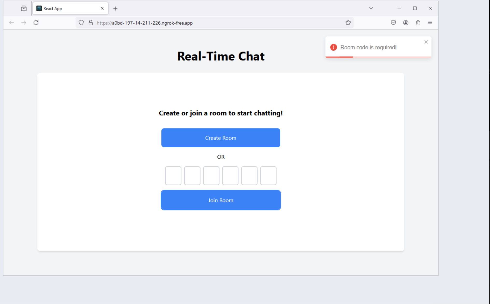

## Browser Compatability Info

For browser compatability, I tried my personal laptop and Saucelabs, Browserstack was heavy on traffic, so I couldn't use it. I used the following browsers:

Ngrok was used here as a reverse proxy to expose the local server to the internet. 

As Saucelabs encountered this know issue https://support.saucelabs.com/s/article/Unable-to-Reach-Application-on-localhost-for-Tests-Run-on-Safari-8-and-9-and-Edge?language=en_US when using their tunnel proxy solution.

